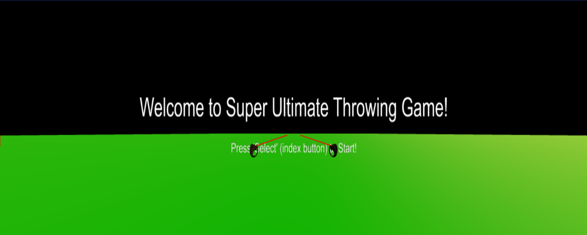

# Super Ultimate Throwing Game!

## Description

Super Ultimate Throwing Game is a VR ball throwing game where players rack up points by hitting plates!
This game is built using only JavaScript, HTML, and the Three.JS Framework!

This project was done for the University of Massachuetts Boston Course CS460: https://cs460.org/

## Playing in VR

1. Turn on VR headset
2. Open Browser
3. Make sure VR is enabled in the Browser
4. Go to https://miclaude07.github.io/CS460student/final_project/
5. Click **ENTER VR** and Play!

## Testing without VR Headset

1. Open Google Chrome or FireFox (or other Browsers that can use Chrome Extensions)
2. Install this WebXR Emulator plugin by Mozilla https://chromewebstore.google.com/detail/webxr-api-emulator/mjddjgeghkdijejnciaefnkjmkafnnje?hl=en and enable it
3. Go to https://miclaude07.github.io/CS460student/final_project/
4. Open Dev Tools
5. Click the tab **WebXR**
6. Click **ENTER VR**
7. In the top left of the **WebXR** tab, open the drop down box and select **Oculus Quest**
8. You should be able to move around the Headset and Controllers in the 3D space using the Emulator

### Emulator Tips:

1. Press an element in the emulator once to translate along axis'
2. Press an element twice to rotate along axis'
3. Press an elemt a third time to deselect the element
4. The space bar will be tied to the last Select/Squeeze button you pressed on a controller. To test throwing, click select on the controller's options and now the space bar should be tied to that controller's select option.
5. Move the controller around and press space bar to create and throw balls

### Tweakpane Options

This panel appears in flatscreen and is also behind the player in VR however the sliders do not work.

- MAX_PLATES: Maximum number of plates on the screen at once. Default: 7
- MAX_PLATE_SP: Max speed a plate can spawn with. Default: 2.0
- PLATE_CD_SEC: Cooldown time between plates spawning. Default: 3.0
- HARDMODE: Makes it so missing a plate subtracts 1 point. Default: False (Buggy)
- Give: Gives player selected powerup
- Toggle Hit Boxes: Toggles hit boxes on and off. Default: Off
- Reset: Resets points and current game state

## Powerups

- Freeze: When empowered with Freeze and hitting a plate, freezes all plates in the scene for 3 seconds.
- Bomb: When empowered with Bomb and hitting a plate, destroy all plates in the scene.
- Rocket: Ball has a scaled up speed. When empowered with rocket and hittign a plate, destroy plates in a radius and leave a lingering field which destroys plates that enter it
- Hollow Purple: Inspired by the move of the same name from Jujutsu Kaisen. Press select on both controllers then combine the red and blue orbs. This will create a larger, purple orb. Letting go of select will launch the orb straight froward, destroying any plate it runs into. (Deselecting the red or blue orb before combining will cancel the Hollow Purple State)
- Spirit Bomb: Inspired by the move of the same name from Dragonball Z. Press select on a controller and a giant light blue orb will spawn above you. This orb will be treated like any other ball. Deselecting will release the orb and start applying physics to it based on the player's throwing speed and direction.
- Sword: While empowered with Sword, selecting and holdind select will turn the controller into a long sword that can destroy plates it comes in contact with. This state will last for a few seconds. Deselecting while the sword is activate will end the sword state early. (New balls cannot be created by a controller in Sword state)

## Future Work

- Add textures and more detailed models. Possibly keeping this more simple design but still giving it its own flavor.
- Add sound effects and background music.
- Add support for sliders on Tweakpane and have the HTML model be more reactive with clicks
- Fix bugs. I've played test with a few people and while it can play well, bugs can pop up on occasion.
- Refactor code to make scalability even easier.
- Revamp and port to Unity.

### Used Soruces:

https://threejs.org/docs/#api/en/math/Box3
https://threejs.org/docs/#api/en/helpers/BoxHelper
https://developer.mozilla.org/en-US/docs/Web/JavaScript/Reference/Global_Objects/Math/random
https://github.com/mrdoob/three.js/blob/master/examples/webxr_vr_handinput_pointerclick.html
https://github.com/mrdoob/three.js/blob/master/examples/webxr_vr_sandbox.html
https://github.com/mrdoob/three.js/blob/dev/examples/jsm/interactive/InteractiveGroup.js
https://tweakpane.github.io/docs/input-bindings/#number
